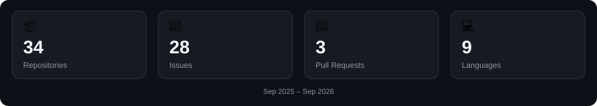

# Sourav Yadav

### Software Development Engineer · Web3 Protocol Engineer · Smart Contract Security Researcher · AI-Native Builder

Building reliable software across backend systems, blockchain protocols, smart contracts, and AI-native engineering workflows.

**21+ DeFi protocols audited · 4+ Web3 projects engineered**

 

 

[GitHub](https://github.com/Sourav-IIITBPL) ·
[LinkedIn](https://linkedin.com/in/0xsourav) ·
[X](https://x.com/0xSouravAudit) ·
[Email](mailto:sourav.dev.official@outlook.com)

 

---

## Snapshot

  

---

## About

I'm a software engineer focused on building and securing complex systems across **backend engineering, Web3 protocols, smart contracts, and AI-native development**.

My Web3 work spans **DeFi protocol engineering and security research**—from Solidity development and protocol architecture to invariant analysis, fuzzing, exploit PoCs, and adversarial review.

I also build with **AI-native and agentic workflows**, using LLMs and developer agents to accelerate architecture, implementation, testing, code review, and automation while continuing to deepen my foundations in ML, LLM systems, RAG, and evaluation.

**Currently open to:** Software Development · Web3 Protocol Engineering · Smart Contract Security · AI-Native / Applied AI Engineering

---

## Engineering Focus

### 🧱 Software Engineering
DSA · OOP · DBMS · OS · Networks · System Design · Backend · APIs · Full-Stack

### ⛓️ Web3 & Protocol Engineering
Smart Contracts · EVM · DeFi · DEX Infrastructure · Vaults · Protocol Architecture

### 🛡️ Smart Contract Security
Manual Audits · Invariant Analysis · Fuzzing · Exploit PoCs · Adversarial Testing · Protocol Accounting

### 🤖 AI-Native Engineering
LLM Applications · RAG · Agentic Workflows · AI-Assisted Development · Developer Automation · Evaluation

---

## Featured Projects

### PreFlight

**Pre-Transaction Security Middleware**

- Built transaction-analysis middleware for **DEX and ERC-4626 vault interactions**, validating transactions before execution.
- Combined **Chainlink CRE off-chain simulation** with on-chain guard contracts for protocol and transaction-risk validation.
- Implemented transaction decoding, backend workflow orchestration, contract interaction layers and NFT-based risk reporting.
- Built a reusable React/TypeScript interface with execute/abort workflows.
- Deployed across **Base, Ethereum and Arbitrum testnets**.

[Repository →](https://github.com/Sourav-IIITBPL/preflight)

### Protocol Invariant Checker

**Automated DeFi Security Analysis Framework**

- Built a modular **Rust CLI** for protocol security analysis, invariant testing and structured audit reporting.
- Designed a protocol-agnostic architecture using trait-based abstractions.
- Allows new protocol implementations to be integrated without modifying the core analysis engine.
- Produces structured security reports with severity classification and actionable vulnerability insights.

[Repository →](https://github.com/Sourav-IIITBPL/protocol-invariant-checker)

### DexGateway

**Multi-Chain DEX Routing Infrastructure**

- Built unified DEX routing infrastructure integrating **7 Uniswap V2-style DEXs across 9 networks**.
- Designed reusable router abstractions for swaps, liquidity provisioning and liquidity withdrawal.
- Implemented liquidity discovery and execution routing across fragmented liquidity environments.
- Engineered multi-chain transaction workflows connecting protocol infrastructure with the frontend.

[Repository →](https://github.com/Sourav-IIITBPL/DexGateway)

---

## Smart Contract Security Track Record

Independent security researcher participating across **Sherlock, Code4rena and Cantina** since July 2025.

- **21+ production DeFi protocols audited**
- AMMs, lending markets, ERC-4626 vaults, staking and DEX infrastructure
- Focused on protocol accounting, invariants, state transitions and economic attack surfaces
- Manual review → invariant analysis → adversarial testing → Foundry PoC → root-cause analysis

[Audit Archive →](https://github.com/Sourav-IIITBPL/audits)

---

## Competitive Programming

- 🏆 **[LeetCode Knight](https://leetcode.com/u/SouravIIIT)** — 1868 rating
- ⭐ **[CodeChef 2★](https://www.codechef.com/users/sourav_yadav25)**
- 💡 **500+ DSA problems solved**
- Strong foundation in algorithms, data structures, and problem solving

---

## Tech Stack

### Languages

### Smart Contracts & Security

### Web3 & Blockchain

### DeFi

### AI / ML & Agentic Engineering

### Backend & Data

### Frontend

### Platforms & Tools

---

## GitHub Activity

  

---

## 🏆 Achievements & Certifications

- **HackVision 2026** — Top 100 finalist among 400+ teams
- **Cyfrin Updraft Certifications** — advanced Solidity, security and protocol testing
- **HER DAO Rust Cohort 1** — Graduate
- **Smart India Hackathon 2024** — National participant, Team Lead
- **AlgoUniversity Tech Fellowship** — 2024 & 2025 cohorts

---

## Education

**B.Tech, Electronics & Communication Engineering** — IIIT Bhopal  
*Expected Graduation: 2027*

---

### Open to Software Development · Web3 Protocol Engineering · Smart Contract Security · AI-Native Engineering Roles

**sourav.dev.official@outlook.com**

